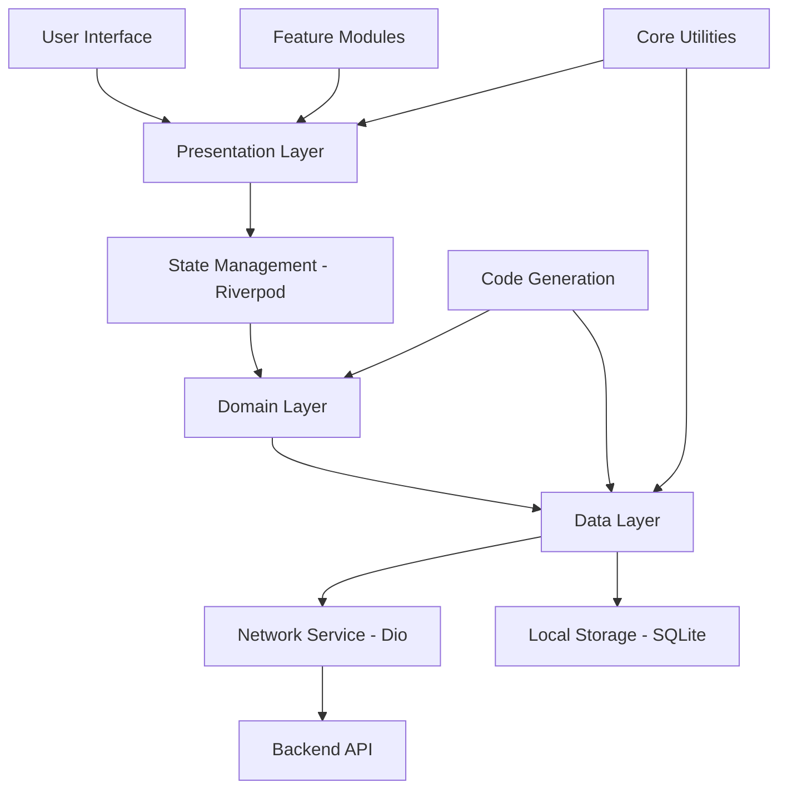

# 🌍 GIS Dashboard - Flutter Application

A high-performance, cross-platform Flutter application for geographic information system visualization of vaccination data for Bangladesh. This application provides interactive maps, comprehensive data visualization, and detailed analytics for the Expanded Program on Immunization (EPI).

## 📋 Table of Contents

- [🎯 Overview](#-overview)
- [🏗️ Architecture](#️-architecture)
- [📁 File Structure](#-file-structure)
- [🚀 Quick Start](#-quick-start)
- [🔧 Environment Setup](#-environment-setup)
- [💻 Development Guide](#-development-guide)
- [📱 Building & Deployment](#-building--deployment)
- [⚡ Performance Optimization](#-performance-optimization)
- [🧪 Testing](#-testing)
- [📖 API Documentation](#-api-documentation)
- [🔒 Security](#-security)
- [🐛 Troubleshooting](#-troubleshooting)
- [🔄 Maintenance](#-maintenance)
- [📞 Support](#-support)

## 🎯 Overview

### Key Features

- **Interactive GIS Map**: Hierarchical drilldown from country to subblock level with real-time data visualization
- **Vaccination Coverage Visualization**: Color-coded maps showing coverage percentages with interactive tooltips
- **EPI Center Finder**: Location-based search for nearby EPI centers within 5km radius with GPS integration
- **Session Planning**: Visualize vaccination session plans on map with date range filtering
- **Statistical Dashboard**: Comprehensive charts and tables with performance metrics and analytics
- **Comprehensive Filtering**: Filter by vaccine type, area, year, and date ranges with real-time updates
- **Cross-Platform Support**: Native apps for Android, iOS, Web, Windows, Linux, and macOS
- **Offline Capabilities**: Local caching with SQLite for offline data access
- **Real-time Updates**: Live data synchronization with backend API

### Technology Stack

- **Framework**: Flutter 3.8.1+ (Dart 3.8.1+)
- **State Management**: Riverpod 2.6.1
- **Architecture**: Clean Architecture with feature-driven structure
- **Maps**: flutter_map 7.0.2 with GeoJSON support
- **Charts**: fl_chart 1.1.1, Syncfusion Flutter Charts 31.1.21
- **Networking**: Dio 5.9.0 with retry logic and interceptors
- **Local Storage**: SQLite (sqflite 2.4.2)
- **Code Generation**: Freezed 3.2.0 + json_serializable 6.10.0
- **Location Services**: Geolocator 13.0.1
- **Permissions**: Permission Handler 11.3.1

### Target Users

- Health administrators and coordinators
- EPI program managers
- Field health workers
- Data analysts and researchers
- Policy makers and decision makers

### Key Sponsors

- **UNICEF** - Supported by
- **EQMS** - Powered by
- **Bangladesh Government** - BD Map data provider

## 🏗️ Architecture

### Architecture Diagram



### Clean Architecture Layers

```
┌─────────────────────────────────────┐
│     Presentation Layer              │
│  (Screens, Widgets, Controllers)    │
└──────────────┬──────────────────────┘
               │
┌──────────────▼──────────────────────┐
│     Domain Layer                      │
│  (Models, State, Business Logic)      │
└──────────────┬──────────────────────┘
               │
┌──────────────▼──────────────────────┐
│     Data Layer                       │
│  (Repositories, Data Services)       │
└──────────────┬──────────────────────┘
               │
        ┌──────┴──────┐
        │             │
    ┌───▼───┐    ┌───▼───┐
    │  API  │    │Local DB│
    └───────┘    └───────┘
```

### State Management Flow

```
User Action
    ↓
UI Widget (ConsumerWidget)
    ↓
StateNotifier (Business Logic)
    ↓
Repository (Data Access)
    ↓
DataService (Network/Local)
    ↓
API Response / Local Data
    ↓
State Update
    ↓
UI Rebuild
```

### Feature Module Structure

Each feature follows a consistent Clean Architecture pattern:

```
feature_name/
├── data/                     # Data layer
│   └── repository.dart      # Data repository implementation
│
├── domain/                   # Domain layer
│   ├── models/              # Domain models (Freezed)
│   └── state.dart           # State classes
│
└── presentation/             # Presentation layer
    ├── controllers/         # StateNotifier controllers
    ├── screens/             # UI screens
    └── widgets/             # Reusable widgets
```

## 📁 File Structure

```
GIS_Dashboard/
│
├── lib/                       # 💻 Source code
│   ├── core/                 # Shared utilities and services
│   │   ├── common/          # Constants, widgets, screens
│   │   ├── network/         # HTTP client, interceptors
│   │   ├── service/         # Data service layer
│   │   └── utils/            # Utility functions
│   │
│   ├── features/             # Feature modules
│   │   ├── map/             # Interactive GIS map
│   │   ├── filter/          # Filtering system
│   │   ├── summary/         # Statistical dashboard
│   │   ├── epi_center/      # EPI center details
│   │   ├── epi_center_finder/  # Location-based EPI center search
│   │   ├── session_plan/    # Session planning
│   │   ├── micro_plan/      # Microplanning tools
│   │   ├── zero_dose_dashboard/  # Zero-dose tracking
│   │   ├── gis_methodology/ # Methodology documentation
│   │   └── home/            # Home screen
│   │
│   ├── config/              # Configuration files
│   │   └── env_config.dart  # Environment configuration
│   │
│   └── main.dart            # Application entry point
│
├── test/                     # 🧪 Test files
│   └── widget_test.dart
│
├── assets/                   # 🎨 Static assets
│   ├── icons/               # App icons (SVG, PNG)
│   ├── images/              # Images
│   └── processing/         # Processing-related assets
│
├── docs/                     # 📚 System documentation
│   ├── README.md           # Documentation index
│   ├── architecture.md     # System architecture
│   ├── api.md              # API documentation
│   ├── deployment.md       # Deployment guide
│   ├── database-schema.md  # Database schema
│   └── troubleshooting.md  # Troubleshooting guide
│
├── docker/                   # 🐳 Docker configuration
│   ├── Dockerfile          # Multi-stage build for web
│   ├── docker-compose.yml  # Docker Compose config
│   ├── nginx/
│   │   └── nginx.conf     # Nginx server config
│   └── README.md          # Docker documentation
│
├── scripts/                  # 🔧 Deployment/maintenance scripts
│   ├── deploy.sh          # Deployment automation
│   ├── backup.sh          # Backup script
│   └── migrate.sh         # Migration script
│
├── .github/                  # 🔄 CI/CD + templates
│   ├── workflows/
│   │   └── ci.yml         # GitHub Actions CI
│   ├── ISSUE_TEMPLATE/
│   │   ├── bug_report.md  # Bug report template
│   │   └── feature_request.md  # Feature request template
│   └── PULL_REQUEST_TEMPLATE.md  # PR template
│
├── android/                  # 🤖 Android platform
├── ios/                      # 🍎 iOS platform
├── web/                      # 🌐 Web platform
├── windows/                  # 🪟 Windows platform
├── linux/                    # 🐧 Linux platform
├── macos/                    # 🍎 macOS platform
│
├── .env.example             # 🔐 Environment variables template
├── .gitignore                # Git ignore rules
├── README.md                 # 📖 This file
├── CHANGELOG.md              # 📝 Version history
├── CONTRIBUTING.md           # 🤝 Contribution guidelines
├── LICENSE                   # ⚖️ License file
├── PROJECT_STRUCTURE.md      # 📁 Project structure overview
├── pubspec.yaml              # 📦 Flutter dependencies
├── pubspec.lock              # 🔒 Locked dependencies
└── analysis_options.yaml     # 🔍 Dart analyzer config
```

For detailed structure documentation, see [PROJECT_STRUCTURE.md](PROJECT_STRUCTURE.md).

## 🚀 Quick Start

### Prerequisites

- **Flutter SDK**: 3.8.1 or higher
- **Dart SDK**: 3.8.1+ (included with Flutter)
- **IDE**: Android Studio, VS Code, or IntelliJ IDEA
- **Git**: For version control
- **Platform-specific tools**:
  - **Android**: Android SDK, Android Studio
  - **iOS**: Xcode 14+ (macOS only)
  - **Web**: Chrome/Edge for testing
  - **Windows**: Visual Studio 2022 with C++ tools
  - **Linux**: GTK development libraries
  - **macOS**: Xcode Command Line Tools

### 1. Clone Repository

```bash
git clone https://github.com/pinjor/GIS_Dashboard.git
cd GIS_Dashboard
```

### 2. Install Dependencies

```bash
flutter pub get
```

### 3. Configure Environment

```bash
# Copy environment template
cp .env.example .env

# Edit .env with your configuration
# See Environment Setup section for details
```

### 4. Generate Code

```bash
# Generate Freezed and JSON serialization code
dart run build_runner build --delete-conflicting-outputs
```

This generates the `.freezed.dart` and `.g.dart` files required for the application.

### 5. Run the Application

```bash
# Run on connected device/emulator
flutter run

# Run on specific platform
flutter run -d chrome          # Web
flutter run -d windows         # Windows
flutter run -d macos           # macOS
flutter run -d linux           # Linux
flutter run -d <device-id>     # Specific device
```

### 6. Verify Installation

```bash
# Check Flutter installation
flutter doctor

# Run tests
flutter test

# Analyze code
flutter analyze
```

## 🔧 Environment Setup

### Environment Variables

Create a `.env` file in the project root (copy from `.env.example`):

```env
# URL Configuration
URL_SCHEME=https
STAGING_SERVER_HOST=staging.gisdashboard.online
STAGING_SERVER_FULL_URL=https://staging.gisdashboard.online
URL_COMMON_PATH=/api/v1

# Production Configuration (if different from staging)
# PRODUCTION_SERVER_HOST=production.gisdashboard.online
# PRODUCTION_SERVER_FULL_URL=https://production.gisdashboard.online

# API Configuration (optional)
# API_TIMEOUT=30000  # Timeout in milliseconds
# API_RETRY_COUNT=3  # Number of retry attempts

# Feature Flags (optional)
# ENABLE_ANALYTICS=false
# ENABLE_CRASH_REPORTING=false
# DEBUG_MODE=false

# Logging Configuration (optional)
# LOG_LEVEL=info  # debug, info, warning, error
# ENABLE_NETWORK_LOGGING=false
```

### Platform-Specific Configuration

#### Android

**Location Permissions** (`android/app/src/main/AndroidManifest.xml`):
```xml
<uses-permission android:name="android.permission.ACCESS_FINE_LOCATION"/>
<uses-permission android:name="android.permission.ACCESS_COARSE_LOCATION"/>
<uses-permission android:name="android.permission.INTERNET"/>
```

**App Signing** (`android/app/build.gradle.kts`):
```kotlin
signingConfigs {
    create("release") {
        storeFile = file("path/to/keystore.jks")
        storePassword = System.getenv("KEYSTORE_PASSWORD")
        keyAlias = "upload"
        keyPassword = System.getenv("KEY_PASSWORD")
    }
}
```

#### iOS

**Location Permissions** (`ios/Runner/Info.plist`):
```xml
<key>NSLocationWhenInUseUsageDescription</key>
<string>This app needs location access to find nearby EPI centers.</string>
<key>NSLocationAlwaysUsageDescription</key>
<string>This app needs location access for EPI center finder functionality.</string>
```

**Code Signing**: Configure in Xcode under Signing & Capabilities.

#### Web

**Configuration** (`web/index.html`):
- Update base href if deploying to subdirectory
- Configure CSP headers if needed
- Set up PWA manifest for offline support

## 💻 Development Guide

### Development Workflow

#### 1. Code Generation

After modifying model files with `@freezed` or `@JsonSerializable`:

```bash
# Watch mode (auto-regenerate on file changes)
dart run build_runner watch --delete-conflicting-outputs

# One-time build
dart run build_runner build --delete-conflicting-outputs

# Clean and rebuild
dart run build_runner clean
dart run build_runner build --delete-conflicting-outputs
```

#### 2. Code Style

```bash
# Format code
dart format .

# Analyze code
flutter analyze

# Fix auto-fixable issues
dart fix --apply
```

#### 3. Hot Reload & Hot Restart

- **Hot Reload** (`r`): Preserves app state, fast updates
- **Hot Restart** (`R`): Resets app state, full restart
- **Full Restart**: Stop and restart the app

### Development Tools

#### Flutter DevTools

```bash
# Launch DevTools
flutter pub global activate devtools
flutter pub global run devtools
```

Access at: `http://localhost:9100`

#### Debugging

```dart
// Print debugging
print('Debug message');

// Breakpoints in IDE
// Use Flutter DevTools for performance profiling
```

### Feature Development

#### Creating a New Feature

1. **Create feature structure**:
```bash
lib/features/new_feature/
├── data/
│   └── repository.dart
├── domain/
│   ├── models/
│   └── state.dart
└── presentation/
    ├── controllers/
    ├── screens/
    └── widgets/
```

2. **Define domain models** (using Freezed):
```dart
@freezed
class NewFeatureModel with _$NewFeatureModel {
  const factory NewFeatureModel({
    required String id,
    required String name,
  }) = _NewFeatureModel;
  
  factory NewFeatureModel.fromJson(Map<String, dynamic> json) =>
      _$NewFeatureModelFromJson(json);
}
```

3. **Create state class**:
```dart
class NewFeatureState {
  final bool isLoading;
  final List<NewFeatureModel> items;
  final String? error;
  
  // ... constructor and copyWith
}
```

4. **Implement repository**:
```dart
class NewFeatureRepository {
  final DataService _dataService;
  
  Future<List<NewFeatureModel>> getItems() async {
    // Implementation
  }
}
```

5. **Create StateNotifier**:
```dart
class NewFeatureController extends StateNotifier<NewFeatureState> {
  final NewFeatureRepository _repository;
  
  // Implementation
}
```

6. **Build UI**:
```dart
class NewFeatureScreen extends ConsumerWidget {
  @override
  Widget build(BuildContext context, WidgetRef ref) {
    final state = ref.watch(newFeatureControllerProvider);
    // UI implementation
  }
}
```

### Code Organization Best Practices

- **Separation of Concerns**: Keep business logic in domain layer
- **Dependency Injection**: Use Riverpod providers for dependencies
- **Immutable State**: Use Freezed for immutable state classes
- **Error Handling**: Handle errors gracefully with user-friendly messages
- **Code Reusability**: Extract common widgets to `core/common/`
- **Documentation**: Add comments for complex logic

## 📱 Building & Deployment

### Build Configurations

#### Android

```bash
# Debug APK
flutter build apk --debug

# Release APK
flutter build apk --release

# Split APKs (by ABI)
flutter build apk --split-per-abi --release

# App Bundle (for Play Store)
flutter build appbundle --release

# Build with specific flavor
flutter build apk --release --flavor production
```

**Output Locations**:
- APK: `build/app/outputs/flutter-apk/app-release.apk`
- App Bundle: `build/app/outputs/bundle/release/app-release.aab`

#### iOS

```bash
# Debug build
flutter build ios --debug

# Release build (no code signing)
flutter build ios --release --no-codesign

# Release build with code signing
flutter build ios --release

# Build for simulator
flutter build ios --simulator --release
```

**Output Location**: `build/ios/iphoneos/Runner.app`

#### Web

```bash
# Release build
flutter build web --release

# Build with base href
flutter build web --release --base-href="/gis-dashboard/"

# Build with PWA support
flutter build web --release --pwa-strategy=offline-first
```

**Output Location**: `build/web/`

#### Desktop Platforms

```bash
# Windows
flutter build windows --release

# Linux
flutter build linux --release

# macOS
flutter build macos --release
```

### Automated Deployment

Use the deployment script:

```bash
# Deploy for Android
./scripts/deploy.sh android release

# Deploy for iOS
./scripts/deploy.sh ios release

# Deploy for Web
./scripts/deploy.sh web release

# Deploy for Windows
./scripts/deploy.sh windows release
```

### Docker Deployment (Web)

```bash
# Build Docker image
docker build -f docker/Dockerfile -t gis-dashboard:latest .

# Run with Docker Compose
cd docker
docker-compose up -d

# Access at http://localhost:8080
```

For detailed Docker deployment, see [docker/README.md](docker/README.md).

### Platform-Specific Deployment

#### Android (Google Play Store)

1. Build app bundle: `flutter build appbundle --release`
2. Upload to Google Play Console
3. Complete store listing and submit for review

#### iOS (App Store)

1. Build iOS app: `flutter build ios --release`
2. Open in Xcode: `open ios/Runner.xcworkspace`
3. Archive and upload via Xcode or Transporter

#### Web (Production Server)

1. Build web: `flutter build web --release`
2. Deploy `build/web/` to web server
3. Configure server for SPA routing (see [docs/deployment.md](docs/deployment.md))

For detailed deployment instructions, see [docs/deployment.md](docs/deployment.md).

## ⚡ Performance Optimization

### Code Optimization

#### 1. Widget Optimization

```dart
// Use const constructors where possible
const Text('Static text')

// Use const widgets
const SizedBox(height: 16)

// Extract widgets to prevent unnecessary rebuilds
class OptimizedWidget extends StatelessWidget {
  @override
  Widget build(BuildContext context) {
    return const ExpensiveWidget();
  }
}
```

#### 2. State Management Optimization

```dart
// Use select for granular updates
final count = ref.watch(counterProvider.select((state) => state.count));

// Use listen for side effects
ref.listen(counterProvider, (previous, next) {
  // Handle state changes
});
```

#### 3. Network Optimization

```dart
// Implement caching
final cachedData = await cache.get('key');
if (cachedData != null) return cachedData;

// Use compression for large payloads
// GeoJSON files are already compressed (GZip)

// Implement request cancellation
final cancelToken = CancelToken();
// Cancel if needed: cancelToken.cancel();
```

#### 4. Map Performance

```dart
// Limit marker count
if (markers.length > 1000) {
  // Use clustering or filtering
}

// Use tile caching
TileLayer(
  urlTemplate: 'https://tile.openstreetmap.org/{z}/{x}/{y}.png',
  tileProvider: CachedNetworkTileProvider(),
)
```

### Memory Management

- **Dispose Resources**: Properly dispose controllers and streams
- **Image Optimization**: Use appropriate image formats and sizes
- **List Optimization**: Use `ListView.builder` for long lists
- **Cache Management**: Implement cache size limits

### Build Optimization

```bash
# Build with tree-shaking
flutter build apk --release --split-debug-info=build/debug-info

# Obfuscate code (Android/iOS)
flutter build apk --release --obfuscate --split-debug-info=build/debug-info

# Analyze app size
flutter build apk --analyze-size
```

## 🧪 Testing

### Running Tests

```bash
# Run all tests
flutter test

# Run with coverage
flutter test --coverage

# Run specific test file
flutter test test/widget_test.dart

# Run tests in watch mode
flutter test --watch

# Run tests with verbose output
flutter test --verbose
```

### Test Types

#### Unit Tests

```dart
void main() {
  test('should calculate distance correctly', () {
    final distance = calculateDistance(23.8103, 90.4125, 23.6850, 90.3563);
    expect(distance, closeTo(15.5, 0.1));
  });
}
```

#### Widget Tests

```dart
void main() {
  testWidgets('should display EPI center name', (tester) async {
    await tester.pumpWidget(
      MaterialApp(
        home: EpiCenterCard(center: mockCenter),
      ),
    );
    
    expect(find.text('EPI Center Name'), findsOneWidget);
  });
}
```

#### Integration Tests

```dart
void main() {
  IntegrationTestWidgetsFlutterBinding.ensureInitialized();
  
  testWidgets('complete user flow', (tester) async {
    // Test complete user journey
  });
}
```

### Test Coverage

```bash
# Generate coverage report
flutter test --coverage

# View coverage (requires lcov)
genhtml coverage/lcov.info -o coverage/html
open coverage/html/index.html
```

## 📖 API Documentation

### API Endpoints

The application communicates with a REST API. For complete API documentation, see [docs/api.md](docs/api.md).

#### Key Endpoints

**Geographic Data**:
- `GET /shapes/{slug}/shape.json.gz` - Get GeoJSON shapes
- `GET /coverage/{slug}/{year}-coverage.json` - Get coverage data

**EPI Centers**:
- `GET /epi/{slug}/epi.json` - Get EPI center coordinates
- `GET /chart/{orgUid}?year={year}&request-from=app` - Get EPI center details

**Session Plans**:
- `GET /session-plans?area={area}&start_date={date}&end_date={date}` - Get session plans

**Areas**:
- `GET /areas` - Get area hierarchy
- `GET /get/{type}/child-data` - Get child areas

### API Usage Examples

```dart
// Fetch coverage data
final response = await dio.get(
  '/coverage/dhaka-district/2025-coverage.json',
);

// Fetch EPI centers
final epiResponse = await dio.get(
  '/epi/dhaka-district/epi.json',
);

// Fetch session plans
final sessionPlans = await dio.get(
  '/session-plans',
  queryParameters: {
    'start_date': '2025-01-01',
    'end_date': '2025-01-31',
  },
);
```

For detailed API documentation, see [docs/api.md](docs/api.md).

## 🔒 Security

### Security Best Practices

#### 1. Environment Variables

- **Never commit** `.env` file to version control
- Use different credentials for each environment
- Rotate API keys and secrets regularly
- Use secure password storage

#### 2. Network Security

```dart
// Use HTTPS only in production
final baseUrl = env.get('STAGING_SERVER_FULL_URL');

// Validate SSL certificates (production)
// SSL bypass only for staging in debug mode
```

#### 3. Data Protection

- **Sensitive Data**: Don't store sensitive data in plain text
- **Local Storage**: Use secure storage for credentials
- **API Keys**: Store in environment variables, not in code

#### 4. Platform-Specific Security

**Android**:
- Use ProGuard/R8 for code obfuscation
- Implement certificate pinning
- Use secure storage for sensitive data

**iOS**:
- Enable App Transport Security
- Use Keychain for sensitive data
- Implement certificate pinning

**Web**:
- Use HTTPS only
- Implement CSP headers
- Sanitize user inputs

### Security Checklist

- [ ] Environment variables properly configured
- [ ] HTTPS enforced in production
- [ ] API keys stored securely
- [ ] User inputs validated and sanitized
- [ ] Error messages don't expose sensitive information
- [ ] Dependencies are up to date
- [ ] Code obfuscation enabled for release builds

## 🐛 Troubleshooting

### Common Issues

#### 1. Build Runner Errors

**Issue**: "Conflicting outputs were detected"

**Solution**:
```bash
dart run build_runner clean
dart run build_runner build --delete-conflicting-outputs
```

#### 2. Missing Generated Files

**Issue**: Compilation errors for `.freezed.dart` or `.g.dart` files

**Solution**:
```bash
flutter clean
flutter pub get
dart run build_runner build --delete-conflicting-outputs
```

#### 3. Location Permission Issues

**Issue**: EPI Center Finder can't get location

**Solution**:
- **Android**: Check `AndroidManifest.xml` has location permissions
- **iOS**: Check `Info.plist` has location usage descriptions
- Grant permission in device settings
- Test on physical device (not emulator)

#### 4. Map Not Loading

**Issue**: Blank map or no polygons displayed

**Solution**:
1. Check internet connection
2. Verify API endpoints in `.env`
3. Check API server accessibility
4. Review network logs for errors
5. Clear app cache and restart

#### 5. Slow Performance

**Issue**: App freezes or slow rendering

**Solution**:
1. Reduce marker count on map
2. Implement marker clustering
3. Use `ListView.builder` for long lists
4. Optimize image sizes
5. Check device memory usage

### Debug Commands

```bash
# Check Flutter installation
flutter doctor -v

# Clean build
flutter clean
flutter pub get

# Analyze code
flutter analyze

# Check dependencies
flutter pub outdated

# View logs
flutter logs
```

For comprehensive troubleshooting guide, see [docs/troubleshooting.md](docs/troubleshooting.md).

## 🔄 Maintenance

### Regular Maintenance Tasks

#### Daily
- Monitor app performance and errors
- Check API connectivity
- Review user feedback

#### Weekly
- Update dependencies (check for security updates)
- Review and optimize code
- Clean up unused assets

#### Monthly
- Update Flutter SDK if stable
- Review and update documentation
- Performance optimization review
- Security audit

#### Quarterly
- Major dependency updates
- Architecture review
- Feature deprecation planning
- Comprehensive testing

### Update Procedures

#### Flutter SDK Update

```bash
# Update Flutter
flutter upgrade

# Verify compatibility
flutter doctor

# Update dependencies
flutter pub upgrade

# Test application
flutter test
flutter run
```

#### Dependency Updates

```bash
# Check outdated packages
flutter pub outdated

# Update dependencies
flutter pub upgrade

# Test after updates
flutter test
flutter analyze
```

#### Code Migration

Use the migration script:

```bash
./scripts/migrate.sh
```

This script:
- Cleans previous builds
- Updates dependencies
- Regenerates code
- Runs tests
- Analyzes code

## 📞 Support

### Getting Help

#### Documentation

- **Main README**: This file
- **Architecture**: [docs/architecture.md](docs/architecture.md)
- **API Docs**: [docs/api.md](docs/api.md)
- **Deployment**: [docs/deployment.md](docs/deployment.md)
- **Troubleshooting**: [docs/troubleshooting.md](docs/troubleshooting.md)
- **Project Structure**: [PROJECT_STRUCTURE.md](PROJECT_STRUCTURE.md)

#### Issue Reporting

1. **Check existing issues**: Search GitHub issues
2. **Check documentation**: Review relevant docs
3. **Create detailed issue**: Use issue templates
4. **Provide information**:
   - Device/platform
   - Flutter version
   - Steps to reproduce
   - Expected vs actual behavior
   - Logs and screenshots

#### Support Channels

- **GitHub Issues**: [Create an issue](https://github.com/pinjor/GIS_Dashboard/issues)
- **Documentation**: See `docs/` directory
- **Troubleshooting Guide**: [docs/troubleshooting.md](docs/troubleshooting.md)

### Contributing

We welcome contributions! Please see [CONTRIBUTING.md](CONTRIBUTING.md) for guidelines.

1. Fork the repository
2. Create a feature branch
3. Make your changes
4. Write/update tests
5. Submit a pull request

For detailed contribution guidelines, see [CONTRIBUTING.md](CONTRIBUTING.md).

## 📝 Changelog

See [CHANGELOG.md](CHANGELOG.md) for a complete list of changes and version history.

### Version 1.0.0 (Current)

**Features**:
- ✅ Interactive GIS map with hierarchical drilldown
- ✅ Vaccination coverage visualization
- ✅ EPI Center Finder with GPS integration
- ✅ Session planning module
- ✅ Statistical dashboard
- ✅ Comprehensive filtering system
- ✅ Cross-platform support (6 platforms)
- ✅ Offline capabilities with local caching

**Technical**:
- ✅ Clean Architecture implementation
- ✅ Riverpod state management
- ✅ Freezed for immutable models
- ✅ Code generation with build_runner
- ✅ GeoJSON support with compression
- ✅ Network layer with retry logic

## 📄 License

This project is licensed under the MIT License - see the [LICENSE](LICENSE) file for details.

## 🙏 Acknowledgments

- **Flutter Team** - For the excellent cross-platform framework
- **Riverpod Team** - For powerful state management
- **flutter_map Contributors** - For the mapping library
- **UNICEF** - Supported by
- **EQMS** - Powered by
- **Bangladesh Government** - BD Map data provider

---

**Built with ❤️ for EPI program in Bangladesh**

**Version**: 1.0.0  
**Last Updated**: January 2025
